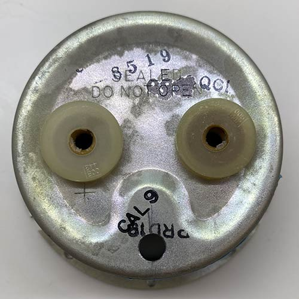
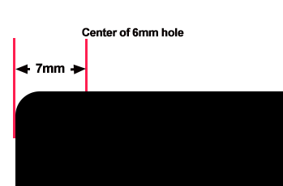
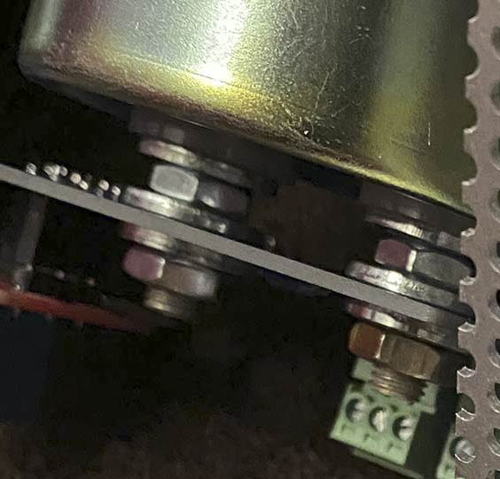
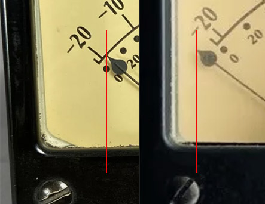
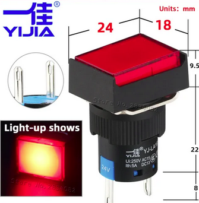
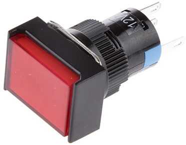
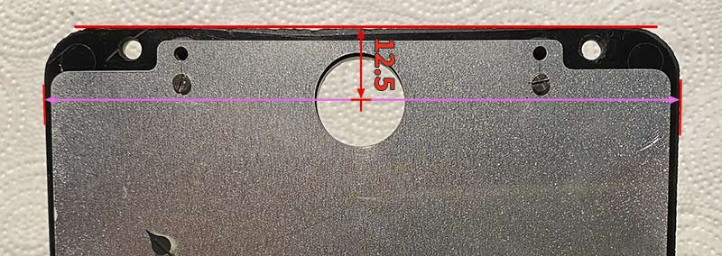
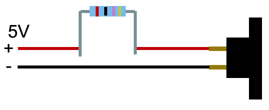
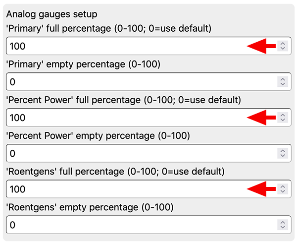

# The Dash Gauges Hardware

The Dash Gauges consist of several parts:
- A **Control Board**: Readily available at [CircuitSetup](https://circuitsetup.us/product/delorean-time-machine-dash-gauge-control-board/). If you want to make it yourself, the production data is in the ["electronics"](/hardware/electronics) folder. 
- The **gauges**: These are vintage meters made by Phaostron and Simpson and need to be sourced by the prop builder. In the picture above you see two modified Phaostron 631-15099 "Cyclic Trim" meters, and a Simpson model 49MC VU Meter disguised as the "Roentgens" gauge. Many other types of meters can be used.
- Aluminium (Aluminum) **bezel**; can be purchased at [CircuitSetup](https://circuitsetup.us/product/delorean-time-machine-dash-plutonium-gauge-bezel/). The measurements are in the ["enclosure"](/hardware/enclosure) folder of this repository. 

This prop was made to be compatible with the CircuitSetup line of movie props ([Time Circuits Display](https://tcd.out-a-ti.me), [Flux Capacitor](https://fc.out-a-ti.me), [SID](https://sid.out-a-ti.me)).

## Control board

|  |
|:--:| 
| *The Control Board* |

The Control board is mounted on the smaller gauges. Its features include
- 5V or 12V power supply
- audio, with speaker connector
- support for "analog" gauges with arbitrary voltages between 0 and 5V, and support for "digital" gauges (0/12V); room for user-mountable resistors to adjust the Control Board to very gauge type used
- "Legacy" connector with pins for 12V digital Roentgens gauge, 12V Roentgens backlight, 12V "Empty" LED
- Time Travel button, plus an additional multi-purpose button ("Button 1"); Time Travel connector for external button
- Connector for two Door Switches, for Door-Sound play-back.
- SD card slot

### "Analog" vs. "Digital" gauges

The terms "analog" and "digital" have the following meaning in this document:

"Analog" gauges are ones that the Control Board can control to show arbitrary values, ie move their pointers to arbitrary positions by using variable voltages. Real Phaostron/Simpson meters will most likely be run as analog meters; best suited are voltmeters, (modified) ammeters or - for the Roentgens gauge: - VU-meters. Meters can be usually driven with minimal voltages, even if their scale is far beyond that. It is mostly a matter of removing the meter's internal resistor(s)/caps/etc, and putting suitable resistors on the Control Board. The Control Board can provide up to 5V and has room for two through-the-hole resistors per meter.

"Digital" gauges are ones that can only be controlled by power-on and power-off for "full" and "empty" pointer positions, respectively; this is useful if the meter needs voltages beyond what the Control Board can provide (which is, as said, 5V), and is driven using external power and through a relay. Alternatively, one might also come up with the idea to create a gauge replica using a stepper motor and some logic to move the pointer to a fixed position on power-on, and move it back to the "empty" position on power-loss, using a large capacitor to power the motor after power-loss.

### Control Board Hardware Configuration

In order to make the Control Board as versatile as possible, there are some solder jumpers (ie adjacent solder pads which are connected using solder), and easy-to-solder through-the-hole resistors which need to be added depending on the other hardware used.

|  |
|:--:| 
| *Click for hi-res image* |

#### Main connectors (red numbers):
- Red_1: 5V input for analog gauges and electronics
- Red_2: 12V input for electronics ("+"/"-" pins) and for digital gauges ("DG+"/"-" pins)
- Red_3: [Time Travel button](#connecting-a-time-travel-button): To trigger a time travel, the button must connect "TT" to "3V3". The connector is also used to connect the Dash Gauges to a TCD [by wire](#connecting-a-tcd-to-the-dash-gauges-by-wire).
- Red_4: Door switches: Switches need to connect "C" and "1" for door 1, and "C" and "2" for door 2.

#### Power supply:

The electronics can be run off 5V or 12V ("+"/"-" pins of connectors [red_1] or [red_2]). If you are using analog gauges only, the choice is yours.

Digital gauges, as well as connecting anything to connector [green_6], require 12V on the "DG+" pin of the 12V power connector [red_2]. If you want to power everything with 12V, connect the power supply to connector [red_2] ("+"/"-" pins), and bridge the "+" and "DG+" pins with a short wire, as indicated by the arc printed on the board.

>For experts: To power the electronics with 5V, but the digital gauges with 12V, put 12V on "DG+" and "-" of the 12V connector [red_2], and 5V on the 5V connector [red_1] or on the ESP32 via USB. Do NOT bridge the "+" and "DG+" pins on [red_2].

#### Other connectors (green numbers):
- Green_1: Speaker for audio output
- Green_2: Backlight for Roentgens gauge (see [here](#gauge-illumination-yellow-numbers))
- Green_3: Analog Roentgens meter
- Green_4: "Empty" LED (for direct connection of white LED, forward voltage 3.3V)
- Green_5: Side switch for triggering empty/refill sequences (maintained on/off)
- Green_6: 12V digital Roentgens meter, 12V Roentgens backlight, 12V "Empty" light

#### Configuration for analog gauges (purple numbers):
- Left gauge ("Primary"):
  - Purple_3: Resistors R3, R4: Populate depending on gauge and supply voltage; see [here](#appendix-a-resistors-for-gauges).
  - Purple_4: Close ANA4 solder jumper; DIG4 [blue_4] must be open
  - Leave "DIG3" [blue_3] unconnected/open
- Center Gauge ("Percent Power"):
  - Purple_1: Resistors R1, R2: Populate depending on gauge and supply voltage; see [here](#appendix-a-resistors-for-gauges).
  - Purple_2: Close ANA2 solder jumper; DIG2 [blue_2] must be open
  - Leave "DIG1" [blue_1] unconnected/open
- "Roentgens" gauge, connected to "Analog Roentgens" connector [green_3]:
  - Purple_5: Resistors R5, R6: Populate depending on gauge and supply voltage; see [here](#appendix-a-resistors-for-gauges).
  - (DIG5 [blue_5]: Does not matter, has no influence on this connector)
 
Example for configuration for three analog gauges:

|  |
|:--:| 
| *Click for hi-res image* |

_Note: CircuitSetup-produced boards are pre-configured for analog gauges; they have trimpots pre-installed at positions [purple_3], [purple_1] and [purple_5], and solder-joints [purple_4] and [purple_2] are closed._

#### Configuration for digital gauges (blue numbers):
- Left gauge:
  - Blue_3: Bridge DIG3 by wire
  - Blue_4: Close DIG4 solder jumper (ANA4 [purple 4] must be open)
  - (R3, R4 [purple_3]: Leave unpopulated or remove)
- Center gauge:    
  - Blue_1: Bridge DIG1 by wire
  - Blue_2: Close DIG2 solder jumper; ANA2 (purple_2) must be open
  - (R1, R2: [purple_1]: Leave unpopulated or remove)
- Roentgens gauge (connected to "Digital Roentgens" connector [green 6]:
  - Blue_5: Bridge DIG5 by wire
  - (R5/R6 [purple 5]: Don't matter, have no influence on this connector)

Example for configuration for three digital gauges:

|  |
|:--:| 
| *Click for hi-res image* |

_Note: CircuitSetup-produced boards have trimpots pre-installed at positions [purple_3], [purple_1] and [purple_5]. These must be removed in order to use digital gauges. Also, ANAx [purple_4, purple_2] solder-joints must be opened, and the DIGx solder-joints [blue_4, blue_2] must be closed for using digital gauges._

You can mix different types of analog and digital gauges; the firmware provides a type selection for each single gauge. In "full digital" configuration, as depicted above, the Control Board can directly replace a 3rd party manufacturer's board in order to integrate "alien" Dash Gauges with other CircuitSetup props. Videos of the board in action with various meters are [here](https://www.facebook.com/61553801874212/videos/pcb.122144723798126729/1554617305398184) (Phaostron 631-14672(H&P), 300-07970; 3rd party digital Roentgens replica) and [here](https://www.facebook.com/61553801874212/videos/pcb.122144723798126729/974052394455407) (3rd party digital Phaostron replicas, Simpson model 29 0-50mA ammeter).

#### Gauge illumination [yellow numbers]:

The gauges can be illuminated
- using "internal" power ("INT", always 5V), or
- using "external" power ("EXT"), fed through connector [yellow_5].

Solder jumper [yellow_4] selects whether INT or EXT is to be used; in case of EXT, connect your power supply to connector [yellow_5]. 

INT is probably sufficient for most setups. The panel depicted above is running on INT with LEDs for the smaller gauges and 6V incandescent light bulbs for the Roentgens gauge. 

Legend:
- Yellow_1 (R7), yellow_2 (R8): Resistors for backlight LEDs of left and center gauge. The supply voltage is either 5V (INT), or whatever you connect to "Ext. Light Power" [yellow_5] (EXT). The resistor value depends on LED type and desired brightness. Example: 150R for yellow LEDs at 5V (INT). A calculator for the resistor value is [here](https://www.digikey.at/en/resources/conversion-calculators/conversion-calculator-led-series-resistor).
- Yellow_3 (R11): Resistor for Roentgens backlight on "Roentgens Light" connector [green 2]. In case of using incandescent light bulbs, just bridge this with a wire. The supply voltage is either 5V (INT), or whatever you connect to "Ext. Light Power" [yellow_5] (EXT).
- Yellow_4 ("Light Power"): Solder jumpers for selecting internal or external gauge illumination power: Connect either INT or EXT. For 5V lighting, close INT. To use external power (max. 12V), close EXT and connect the power supply to "Ext. Light Power" [yellow 5]. 
- Yellow_5 ("Ext. light power" connector): Connector for power supply for "EXT" setting.
- LED1, LED2: Backlight LEDs for left and center gauge. These are soldered to the back of the Control Board so they directly reach into the gauge's enclosure.

Note: The "Digital Roentgens" connector [green 6] also has pins for illuminating the Roentgens gauge. These are always 12V, regardless of INT/EXT, and require 12V input on the DG+/- pins of power connector [red_2].

#### Connecting a Time Travel button

The Control Board has a Time Travel button (marked "TT"). If you want to connect an external Time Travel button, connect it to the "TT" and "3V3" pins of the "Time Travel" connector [red_3].

#### Connecting a TCD to the Dash Gauges by wire

If you want to connect a TCD to the Dash Gauges (for synchronized time travel sequences), wire as follows:

<table>
    <tr>
     <td align="center"><b>Dash Gauges: "Time Travel" connector [red_3]</b></td>
     <td align="center"><b>TCD with control board >=1.3</b></td>
     <td align="center"><b>TCD with control board 1.2</b></td> 
    </tr>
   <tr>
     <td align="center">GND</td>
     <td align="center">GND of "Time Travel" connector</td>
     <td align="center">GND of "IO14" connector</td>
    </tr>
    <tr>
     <td align="center">TT</td>
     <td align="center">TT OUT of "Time Travel" connector</td>
     <td align="center">IO14 of "IO14" connector</td>
    </tr>
</table>

_Do not connect 3V3 to the TCD!_

## Gauges

### The "Primary" and "Percent Power" Gauges

In the Original, these were Phaostron 631 series meters. There are many different types/models of those vintage Phaostron meters; anything that starts with 63x fits size-wise; some 300 series meters also fit. Not all 63x meters are usable though. I haven't seen a complete list, but what I came accross leads to some conclusions: 631 and 634 differ in the method used for movement suspension (pivot-and-jewel vs taut band). Both should be usable; due to their lower moving-element resistance the 634 series might have a lower sensitivity rating (ie they will require higher restistors values). The 633 series appears to look different (360° scale, no faceted glass). Many of the meters in the 637 series and presumably the entire 639 series are highly rated AC meters with iron wane movement, these are probably unusable. I could not find out enough about the 638 series to draw any conclusions. Some meters have their zero position in the center of the scale, so avoid those, too. 

In my (limited) experience the 631 series is the safest bet. Due to the problems the "pivot-and-jewel" design causes (worn jewel, thereby hindered pointer movement), try to find a NOS one.

Tested meter options and configuration:

<table>
  <tr><td><b>Meter</b></td><td><b>Modification</b></td><td><b>R1/R2, R3/R4</b></td><td><b>Gauge type setting</b></td></tr>
  <tr><td>H&P <b>631-14672</b> 0-0.5V DC voltmeter</td><td>Pointer color changed from red to black using an Edding permanent marker</td><td>470R/8k2</td><td>H&P 631-14672</td></tr>
  <tr><td>Phaostron 0-5KV DC voltmeter (<b>300-07970</b>)</td><td>None</td><td>470R/4k7</td><td>Generic Analog (0-5V)</td></tr>
  <tr><td>Phaostron "Cyclic Trim" meter (<b>631-15099</b>)</td><td>The two resistors and the pot inside the meter need to be removed, and the wire (which lead to the pot) needs to be re-attached to the input terminal.</td><td>470R/4k7</td><td>Generic Analog (0-5V)</td></tr>
  <tr><td>Phaostron 0-75V DC voltmeter (<b>631-16471A</b>)</td><td>Internal resistor and caps need to be bridged.</td><td>470R/4k7</td><td>Generic Analog (0-5V)</td></tr>
</table>

Unusable:
- Phaostron 0-50/100/250/500A AC ammeter (**639-16341**).

It is hard to tell what a meter has inside and whether it's usable. Many meters have scales that don't match their actual input (rating or even unit), some require an external "multiplier" (such as the 5KV voltmeter I tested). Ammeters (especially if the scale is in the mA or uA range) can most likely be used after removing shunts, resistors or anything else that is between the two input terminals. 

To find out suitable resistor values for R1/R2 and/or R3/R4 on the Control Board, please see [here](#appendix-a-resistors-for-gauges). The values given in the table above are verified working on my meter samples, but meters might vary, so please verify them for your meters, too.

Movie-accurate dials for those gauges are available in the [hardware/faces-labels](/hardware/faces-labels) folder. In order to avoid the old dial shining through the new dial, apply the new label on the back-side of the original dial. To apply the labels properly, cut them precisely at the bottom and the right hand side (leave some extra at the top and the left hand side), then place the dial in the corner of a 90 deg angled ruler, and align the sticker at the bottom and right hand side. Slowly apply the sticker from the bottom up to avoid bubbles, and in the end, with the sticker facing down, use an Exacto knife to cut off the surplus.

For illumination, there are LEDs mounted on the back of the Control Board that reach into the enclosures of the gauges. These require a 6mm hole in the rear of the metal enclosure (center: 7mm from barrel bottom edge). I used a 5mm yellow LED (590nm). Most replicas use white LEDs, but I think on the A-Car as shown in the Petersen Museum, there are yellow ones used, and I found white ones too bright. 

Phaostron meters have either 6mm (1/4"-28 UNF) or 4mm (8-32 UNC) screw terminals on the back. For the 6mm versions, the LEDs can usually stick out approx 12-16mm from PCB to the LED's top, but you have to check your Phaostron meter for obstacles. For the shorter 4mm terminals the LED must be shorter. Look into your meter to find out about possible depth. The mounting order is meant to be original plastic washer, washer, nut, washer, Control Board, washer, nut.

The "Primary" and "Percent Power" labels are made with a Rotex 880 label maker; the "Primary" is on 1/2" (12mm) tape, the "Percent Power" on 3/8" (9mm).

### The "Roentgens" Gauge

The "Roentgens" gauge is more of a challenge. The pictures above show my modified Simpson model 49 VU meters. The original in the movie was a real Roentgens meter from a CP95 radiac. Such devices are hard to find, let alone one with the correct Simpson meter. The CP95 was built over a long period of time and they used meters from different manufacturers (QVS, Specialty Assy, etc).

There are a lot of Simpson meters that look similar - yet not identical - to what was seen in the movies. However: One - quite important - issue is that hardly any Simpson meters are illuminated. Non-illuminated meters have a front that is 7mm thinner than the fronts of illuminated models, the glass is closer to the dial, and, as a result, the movie-accurate "Empty" light and the red pointer won't fit. _A solution for this problem - in shape of an "extension ring" that is put between the case and the original front, elevating the front by 7mm - is in the works and will be available soon (possibly fall 2024). This extension is required to fit the "Empty" light and the red pointer as described below. It will also allow for easily illuminating a non-illumimated Simpson meter model x9._

A word on Simpson model numbers: Their main model number means mainly "case style", not "specific type of meter". "Model 49" therefore only means "4.5 inch case", but not whether this is a VU meter, a voltmeter, or what not:

The only illuminated Simpson meters - apart from the Roentgens meters - were apparently their VU meters, models 49 (not listed above as they pre-date the catalog) and 142 (10470, 10540). Model 49 has the movie-accurate front - as long as its build date is something around the 1950s or earlier; later models, unfortunately using the same model number, look entirely different. (They added design groups like "Rectangular" or "Wide Vue" over time, and re-used their model numbers together with these design groups. It's all a bit confusing.)

I was lucky to score a **Simpson model 49L VU-meter** and a **Simpson model 49MC VU-meter**. both with the movie-accurate front. They are illuminated through two incandescent light bulbs. 

The **model 142 VU-meters**, while perfectly usable electronically, are a bit smaller (4.25x3.9" vs 4.66x4.2") and look different on the back; their barrel is thicker (3.25" vs 2.78" in diameter), and the screws are not at the outer corners but closer to the barrel. There are special files in the [hardware/enclosure](/hardware/enclosure) folder for model 142 dimensions. Unfortunately, the barrel is so big that it does not allow for a simple hole for the "Empty" light; this must be done another way. Also, there are (at least) two versions of this meter that differ in pointer length. Avoid the version with the short pointer, it does not allow for accurate dial and "Empty" light placement.

If you can't find a model 49 VU-meter or consider the 142 too far off, you could try other Simpson meters; models 29, 39, 49, 59 or 79 fit size-wise. _As mentioned above, these meters have fronts too thin to fit the "Empty" light and the red pointer; you will either need the aforementioned "extension ring" or be ready to compromise._

Many meters are rated for voltages/currents beyond what the Control Board can deliver, but often they can be modified: For instance, the **Simpson model 29 0-50V DC voltmeter** has a 50K resistor inside; bridging this resistor and putting a combination of 680R/4k7 on the Control Board makes the meter show full scale at 5V.

The safest bet is a **model 29** DC _voltmeter_, although I have only tested this up to a 0-100V meter; given the simularities betwen the 0-50V and the 0-100V versions, I suspect that meters up to 300V can be modified in the same way. Model 29 _ammeters_ should work, too, but my only experiences are a 0-1mA and a 0-50mA ammeter. I don't know if higher rated meters can be modified accordingly. 

**Model 39** meters are RF (radio frequency) ammeters, I have no experience with those.

**Model 49** meters, apart from aforementioned VU meters, are AC meters with a rectifier. Those should work; as regards meter rating, see my statement about model 29.

**Model 59** meters use iron vane meter movement instead of a rectifier and appear to be unusable for our purposes.

**Model 79** are wattmeters - no idea if (or how) those can be modified.

For reference, see the 1964 Simpson [catalog](simpson_catalog.pdf).

Tested meter options and configuration:

<table>
  <tr><td><b>Meter</b></td><td><b>Modification</b></td><td><b>R5/R6</b></td><td><b>Gauge type setting</b></td></tr>
  <tr><td>Simpson Roentgens meter</td><td>Internal resistors (one axial, one that looks like a wire wrapped around paper) need to be removed, black wire from meter coil leading to v-shaped terminal in center needs to be attached to input terminal directly.</td><td>8k2/10k</td><td>Generic Analog (0-2.048V)</td></tr>  
  <tr><td>Simpson model 29 0-50V DC voltmeter</td><td>Internal resistor needs to be bridged</td><td>680R/4k7</td><td>Generic Analog (0-5V)</td></tr>
  <tr><td>Simpson model 29 0-100V DC voltmeter</td><td>Internal resistor needs to be bridged</td><td>680R/4k7</td><td>Generic Analog (0-5V)</td></tr>
  <tr><td>Simpson model 29 0-50uA DC ammeter</td><td>Apparently none.</td><td>TBD</td><td>TBD</td></tr>
  <tr><td>Simpson model 29 0-1.0mA DC ammeter</td><td>All built-in resistors, caps etc, if any, must be removed. The meter's input terminals must be directly connected to the meter's coil. (My "NOS" sample was configured this way when I got it, but given its 50+ years of age it could as well be that it was modified at some point.)</td><td>470R/4k7</td><td>Generic Analog (0-5V)</td></tr>
  <tr><td>Simpson model 29 0-50mA DC ammeter</td><td>Internal coil resistor (looks like wire wrapped around paper) in the rear, close to the bottom, needs to be removed: Open the meter, remove the face and just cut the two blank wires leading from the terminals towards the center, the coil resistor will fall out then (be sure to bend down the remaining stubs so that they don't touch anything), the other resistor can remain.</td><td>0R/1k0</td><td>Generic Analog (0-5V)</td></tr>
  <tr><td>Simpson models 49, 142 VU meters</td><td>None</td><td>330R/3k3</td><td>Standard VU-Meter</td></tr>
</table>

Unusable:
- Simpson model 59 voltmeter 0-250V AC. 

>How to take apart a Simpson meter: Those meters are very delicate. They have tiny sprial springs and other parts which need to be handled with outmost care. To take a meter apart in order to access the "electronics" (resistors, caps, diodes, etc), remove nuts and washers from the input terminals and unskrew the two nuts (usually 5.5mm) below the input terminals, then carefully lift the meter's mechanics out of the case. Never unscrew anything on top of the mechanics! Before reassembly, check for washers or other metal parts the magnet might have attracted.

To find out suitable resistor values for R5/R6 on the Control Board, please see [here](#appendix-a-resistors-for-gauges). The values given in the table above are verified working on my meter samples, but meters might vary, so please verify them for your meters, too.

Most Simpson meters have a **drop-shaped pointer top** which is glued to the end of the pointer, and causes the pointer to collide with the "Empty" light. Pointer lenghts vary; in some cases, the pointer is long enough to just cut off the "drop" without the remaining bit appearing too short. In most cases, however, the pointer would be too short without the "drop". I managed to cut the "drop" vertically in half and peel off its remains from the pointer, thereby saving an extra 2-3mm of pointer length. Be careful when attempting that, the pointer bends easily. _Warning_: The pointer has a counter-weight on the opposite end and is perfectly balanced. This counter-weight consists of wire wrapped around the opposite end of the pointer, looking like a spring. When unbalanced, the pointer wanders around when tilting the meter, and doesn't return to its zero position. If you decide to cut off the entire or a piece of the "drop", you need to adjust the counter-weight by pushing/shifting that "spring" a bit towards the center; when the pointer, after softly pushing it to the right, returns to its zero position by itself, and doesn't wander around when tilting the meter, it's balanced. 

The additional **red pointer** is added by 
- drilling a hole into the front (which should be in the center of the original pointer's turning circle; on non-illuminated models x9 this is approx. 1mm above the edge of the flat area with the adjustment screw; with the meter assembled, put a ruler along the pointer and mark the spot where the ruler crosses the center stripe of the pattern; start with a 1mm drill to avoid slipping when drilling onto this stripe),
- bending and painting some steel spring wire (0.4mm) and attaching this wire with a screw. I used an M2 screw, through a 2.5mm hole.

The non-illuminated meters' front part is thinner, so be careful when enlarging the hole for the screw head. Also, for this pointer to fit, you need the aforementioned extension ring to elevate the front part. Without this extension ring, there is no room for the red pointer.

Regarding the **"Empty" light**: I recommend a light like this one (12V version), available on aliexpress and ebay. There are also buttons that look identical and can be used instead.

The LED in those lights/buttons requires 12V. The Control Board has two connectors for the "Empty" LED:
- When using the "Empty Light" [green_4] connector, the light/button's built-in resistor needs to be removed: Pull up the red cover and pull out the LED; then desolder the LED (ie desolder the two metal tops, and push the LED out) and bridge the resistor, or replace it with a wire. Reassemble.
- When using the LED pins of the Digital Roentgens connector [green_6]: No modification of light/button needed, but the Control Board must be fed 12V on the "DG+" pin of the 12V connector [red_2].

Above light/button requires a 16mm hole. The vertical center of this hole is, looking at the meter from the front, at 12.5mm below the enclosure's edge, horizontally centered (relative to the enclosure, not the dial; the dial might be not accurately centered). In order to make the hole into the enclosure and the dial at exactly the same spot, drill the hole with the dial mounted. I used a step drill and drilled from the dial's side. Cover the meter's mechanism and have a vacuum ready, the Bakelite makes a lot of dirt (which could cause problems if it gets into the mechanism). If the steps on your step drill aren't high enough to go through the dial and the back of the enclosure, drill until the hole in the dial is of correct size (16mm), then remove the dial and finish drilling the enclosure. 

In order to avoid the old dial shining through your new label, use the back-side of the dial.

A movie-accurate dial as well as "Empty" label is in the [hardware/faces-labels](/hardware/faces-labels) folder. To apply the dial properly, follow the instructions above for the Phaostron meters.

## Bezel

The bezel consists of three parts: The front and two side pieces. Measurements are in the [hardware/enclosure](/hardware/enclosure) folder of this repository.

You can purchase a bezel at [CircuitSetup](https://circuitsetup.us/product/delorean-time-machine-dash-plutonium-gauge-bezel/); note that it is made for a model 29/39/49/59/79 panel meter as 'Roentgens'; a model 142 meter won't fit.

You additionally need a lever switch (single pole, maintained, ON-OFF), which is mounted on the right hand side piece (see [here](/hardware/enclosure/measurements_side.png) for its position). This switch is called "side switch" hereinafter.

# Appendix A: Resistors for Gauges

The goal of this procedure is to find resistor values that allow to drive the meter with a voltage of 0-5V.

_Note: CircuitSetup-produced Control Boards have pre-installed trimpots. See below on how to perform adjustment for your gauges._

What you need:
- A 5V power supply. If you plan on running the Dash Gauges with a 5V power supply, use that one for the following steps. 
- a set of axial resistors of different values in the range of 10R-20k.

Is my meter an ammeter or a voltmeter? 

Often the scale/dial doean't say. You need to look inside: Ammeters have resistors, coils, shunts, etc that connect the input terminals _to each other_. Voltmeters only have parts between the input terminal and the coil.

For our purposes, however, the difference is unimportant. In order to make the meter work with the Dash Gauges Control Board, _all built-in resistors, coils, capacitors, shuts, etc need to be removed_. The input terminals must to be connected to the meter's coil with nothing inbetween.

In case of the "Roentgens" meter, align the pointer's "zero position" to the "green zero" on the "Roentgens" dial at this point.

Now build your testing "circuit":

To find out suitable resistor values for R1/R2, R3/R4 or R5/R6, start out with a 10k resistor between the + output of the power supply and the + of the gauge (usually the left terminal when looking at the back).

Look at the needle when applying power:
- If the needle hits the right end point, remove power immediately and retry with a resistor with a _higher_ ohm value;
- If the needle stops on the way, before reaching the right end of the scale, retry with a resistor with a slightly _lower_ ohm value.

There is room for two resistors per gauge on the Control Board to allow combinations, for instance 3k3 + 330R to achieve 3k6. So you can try daisy-chaining two resistors if you don't find one that makes the needle go nicely close to the right end of the scale.

When you found (a) value(s) that make(s) the needle go exactly to the end point (or slightly below), that is what you put in as
- R3/R4 [purple_3] for the "Primary" gauge (left),
- R1/R2 [purple_1] for the "Percent Power" gauge (center),
- R5/R6 [purple_5] for the "Roentgens" gauge.

If a single resistor does the job, bridge the other position with a wire.

In the Config Portal, set the gauge type to "Generic Analog (0-5V)".

>For experts: The same procedure could be done on the Control Board directly:
>- In the Config Portal, set the ["full" percentage](https://github.com/realA10001986/Dash-Gauges#-primary-full-percentage) of the gauge to 100, and
>- select "Generic Analog 0-5V" as Gauge Type.
>- Connect the gauge to the Control Board, power-up and
>- try to find the correct value by putting resistors (or wire bridges) loosely at the resistor positions on the Control Board.
>  
>For meters with a very low rating (uA, mV), the procedure could be done using 2.048V instead of 5V. In the Config Portal, select "Generic Analog 0-2.048V" as Gauge Type, and do as described above.

### Adjustment on CircuitSetup Control Boards

CircuitSetup-produced boards have pre-installed trimpots (trimmer potentiometers). In order to adjust those for your very gauges, proceed as follows, for each meter:

- Remove all built-in resistors, caps etc from the meter. The meter's input terminals must be directly connected to the meter's coil.
- Check that the trimpot for the meter [purple_3, purple_1, purple_5] is at its maximum resistance.
- Connect the meter to the Control Board.
- Power up; after the startup-sequence, hold the "Time Travel" button for 5 seconds.
- Navigate your browser to the Config Portal.
- Set the Gauge Type to "Generic analog 0-5V"
  
    
- Set the "Full percentage" of the gauge to 100
  
    
- Click "SAVE". The device reboots.
- Wait until the startup-sequence has finished. (If the pointer shoots to the end of the scale, power off, and repeat above steps but set the Gauge Type to "Generic Analog 0-2.048V")
- Turn the screws on the trimpots until the pointer points to the end of the scale.
- Enter the Config Portal and re-set the "Full Percentages" to your desired values (by default 28 for the Phaostron gauges, 65 for the "Roentgens").

_Text & images: (C) Thomas Winischhofer ("A10001986"). See LICENSE._

